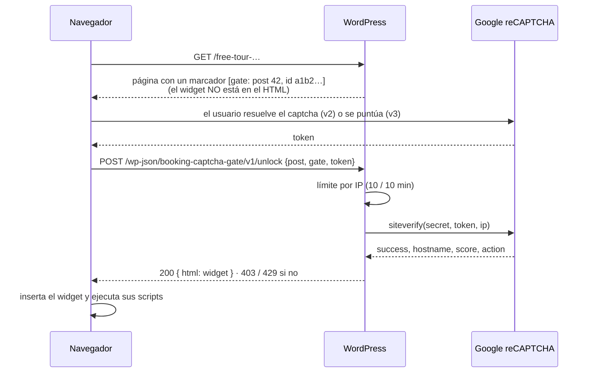

# Booking Captcha Gate

Plugin de **WordPress** que protege los widgets de reserva de terceros (Regiondo, FareHarbor, Bókun, Turitop…) frente a **bots que hacen reservas falsas**. El widget **no se envía a la página**: el servidor lo entrega solo después de verificar reCAPTCHA.

   

## El problema

Los free tours (gratuitos, con reserva obligatoria) de varias webs de una agencia de turismo recibían ráfagas de **reservas automatizadas**: bots que llenaban el aforo de una sesión y dejaban fuera a los clientes reales. El calendario lo sirve un widget del proveedor de reservas, así que no se puede añadir un captcha dentro de su formulario.

La primera solución (v1) ponía una capa con reCAPTCHA encima del widget. Funcionaba para el uso normal, pero tenía un fallo de base: **el widget ya estaba en el HTML de la página** y el token de reCAPTCHA no se verificaba nunca en el servidor. Bastaba con borrar la capa desde DevTools o leer el HTML para saltársela.

## Cómo funciona (v2)



```text
[captcha_gate message="Confirma que no eres un robot para reservar"]
<div id="regiondo-widget" data-product="12345"></div>
<script src="https://widgets.regiondo.net/…"></script>
[/captcha_gate]
```

## Decisiones de diseño

- **Verificación en el servidor** ([`src/Verifier.php`](src/Verifier.php)), con comprobación de:
  - el `hostname`, para que un token resuelto en otra web que use la misma clave no sirva aquí;
  - en v3, la `action` y la puntuación mínima.

  Ante cualquier fallo (red, HTTP, JSON inesperado, sin clave) el widget **no** se entrega.
- **Identificador estable por gate**: es el hash del contenido y no su posición. WordPress puede renderizar el mismo contenido varias veces por petición (extractos, plugins de SEO) y un contador de posición se desincronizaba. El smoke test detectó este caso.
- **El contenido se vuelve a leer del post**: el endpoint no acepta HTML del cliente, solo un id de post y un id de gate. No devuelve nada de borradores ni de posts protegidos con contraseña.
- **Límite de intentos por IP** con transients ([`src/RateLimiter.php`](src/RateLimiter.php)), y `Cache-Control: no-store` en la respuesta.
- **No rompe la venta**: sin claves configuradas, el widget se muestra tal cual.
- **Clave secreta fuera de la base de datos**: se puede definir con `define('BOOKING_CAPTCHA_GATE_SECRET', '…')` en `wp-config.php`.
- **Scripts del proveedor**: `innerHTML` no ejecuta `<script>`, así que se recrean para que el widget arranque igual que si estuviera en la página.

## Estructura

```
booking-captcha-gate.php   Shortcode, endpoint REST, ajustes
src/Verifier.php           Verificación siteverify (sin dependencias de WP)
src/GateContent.php        Localiza el contenido protegido por id
src/RateLimiter.php        Límite por clave con almacenamiento inyectable
assets/gate.js             Captcha (v2 o v3) → desbloqueo → inserción del widget
tests/                     PHPUnit: verificador, ids, límite
tests/smoke/               Plugin completo con stubs de WordPress
```

## Instalación

1. Copia la carpeta a `wp-content/plugins/` y activa el plugin.
2. Ve a **Ajustes → Booking Captcha Gate**, elige la versión (v2 casilla o v3 invisible) e indica la site key y la secret key de [reCAPTCHA](https://www.google.com/recaptcha/admin).
3. Envuelve el widget en `[captcha_gate]…[/captcha_gate]`.

## Tests

```bash
phpunit                           # 20 tests: verificador (v2/v3, hostname, fallos), ids, límite por IP
php tests/smoke/plugin-smoke.php  # 12 comprobaciones del plugin completo con stubs de WordPress
```

El smoke test comprueba, entre otras cosas, que el widget no aparece en la página, que se entrega solo con un token válido, y los códigos 404 (post o gate inexistente, borrador) y 429.

## Licencia

[MIT](LICENSE)
